#  Finatics.AI — AI-Powered Personal Finance Platform

<div align="center">

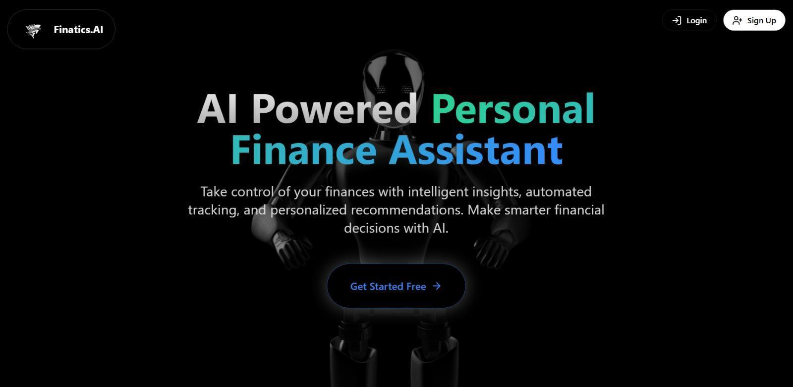

<br/>

[](https://react.dev/)
[](https://nodejs.org/)
[](https://supabase.com/)
[](https://deepmind.google/technologies/gemini/)
[](https://tailwindcss.com/)
[](./LICENSE)

**A full-stack AI-powered personal finance platform built for the Indian market — featuring real-time NSE stock tracking, AI financial advisory, loan analysis, and intelligent goal planning.**

[Features](#-features) • [Tech Stack](#-tech-stack) • [Getting Started](#-getting-started) • [API Docs](#-api-endpoints) • [Screenshots](#-screenshots) • [Contact](#-contact)

</div>

---

## 📋 Table of Contents

- [Overview](#-overview)
- [Features](#-features)
- [Tech Stack](#-tech-stack)
- [Architecture](#-architecture)
- [Screenshots](#-screenshots)
- [Getting Started](#-getting-started)
- [Environment Variables](#-environment-variables)
- [API Endpoints](#-api-endpoints)
- [Database Schema](#-database-schema)
- [Contact](#-contact)

---

## 🌟 Overview

**Finatics.AI** is a comprehensive fintech application that brings together real-time market data, AI-powered financial guidance, and complete banking analytics into one unified dashboard. Built specifically for Indian users, it integrates NSE stock prices via Yahoo Finance, processes financial data through Google Gemini 1.5 AI, and manages user data across a dual Supabase database architecture.

### Key Highlights

- 🤖 **AI Chatbot** — Context-aware financial advisor powered by Gemini 1.5 with 3-model fallback chain
- 📈 **Live NSE Stocks** — Real-time prices via Yahoo Finance with RSI, MACD, Bollinger Band analysis
- 🏦 **Dual Database** — Separate Supabase instances for app data and banking data
- 🎯 **Goal Planner** — AI-generated savings strategies with milestone tracking
- 💰 **Loan Analyzer** — Credit score evaluation with Gemini-powered eligibility recommendations
- 🔒 **Secure Auth** — Supabase authentication + Bcrypt PIN-based secondary security

---

## ✨ Features

### 🏠 Dashboard
- Multi-account banking overview with total balance aggregation
- Monthly income vs. expense trend charts (Recharts)
- Recent transactions with smart categorization
- Investment summary across stocks, mutual funds, and fixed deposits
- Spending breakdown by category

### 🤖 AI Financial Chatbot
- Real-time conversation powered by Google Gemini 1.5 Flash
- Personalized answers based on user's actual savings, expenses, and surplus
- Finance-query filtering — responds only to financial topics
- 3-model fallback chain ensuring high availability
- Floating widget accessible from any page

### 📈 Stock Market & Portfolio
- Live NSE stock prices fetched from Yahoo Finance API
- Portfolio P&L with gain/loss percentages per holding
- Technical indicators: RSI, MACD, EMA, SMA, Bollinger Bands
- Market overview with top movers and sector insights
- AI-powered weekly market insights and news aggregation

### 🎯 Goal Planner
- Create financial goals with target amount and deadline
- AI analyzes feasibility based on income and spending patterns
- SIP/monthly savings recommendations to meet goals
- Progress tracking with visual completion bars
- Risk tolerance-based strategy suggestions

### 💳 Loan Analyzer
- Credit score display pulled from banking database
- 3-month transaction analysis for income/expense averaging
- Ai generated loan eligibility assessment via Gemini
- Supports: Personal, Home, Car, Education, and Business loans
- Detailed approval likelihood with improvement suggestions

### 📚 Learn Section
- Curated financial education content
- Categorized videos and guides for beginners to advanced users

### 🔐 Authentication & Security
- Supabase email authentication with verification flow
- Secondary 4-digit PIN protection (Bcrypt hashed)
- Forgot password and reset flows
- Protected routes with auth middleware

---

## 🛠 Tech Stack

### Frontend
| Technology | Version | Purpose |
|---|---|---|
| React | 19.1.1 | UI Framework |
| Vite | Latest | Build Tool & Dev Server |
| Tailwind CSS | 3.4.17 | Styling |
| Radix UI | Various | Accessible UI Primitives |
| Framer Motion | 12.23.25 | Animations & Transitions |
| Recharts | 3.2.1 | Financial Data Charts |
| React Router DOM | 7.9.1 | Client-Side Routing |
| TanStack Query | 5.90.1 | Server State Management |
| Supabase JS | 2.58.0 | Auth & Database Client |
| Lucide React | 0.544.0 | Icon Library |
| Spline | 4.1.0 | 3D Scene Rendering |
| React Toastify | 11.0.5 | Notifications |

### Backend
| Technology | Version | Purpose |
|---|---|---|
| Node.js + Express | 5.1.0 | REST API Server |
| Supabase JS | 2.58.0 | Database Client (Dual DB) |
| Google Gemini 1.5 | API | AI Financial Advisory |
| Yahoo Finance API | — | Live NSE Stock Prices |
| Bcrypt | 6.0.0 | PIN Hashing |
| Axios | 1.12.2 | HTTP Client |
| Express Rate Limit | 8.2.1 | API Protection |
| RSS Parser | 3.13.0 | Financial News Feeds |
| UUID | 13.0.0 | ID Generation |
| Nodemon | 3.1.10 | Dev Auto-Reload |

### Infrastructure
| Service | Purpose |
|---|---|
| Supabase (App DB) | User profiles, auth, goals, subscriptions |
| Supabase (Banking DB) | Accounts, transactions, stocks, mutual funds |
| Google Gemini 1.5 | AI chatbot, loan analysis, goal planning |
| Yahoo Finance API | Real-time NSE stock prices |

---

## 🏗 Architecture

```
FinAI
├── Frontend (React 19 + Vite)          →  Port 5173
│   ├── Pages (Dashboard, Stocks, Goals, Loans, Chatbot...)
│   ├── Components (Radix UI + custom)
│   ├── Contexts (Auth, Theme)
│   └── Hooks (API, Auth)
│
└── Backend (Node.js + Express 5)       →  Port 3000
    ├── Routes (29 endpoints)
    ├── Controllers (business logic)
    ├── Services
    │   ├── AI Services (Gemini, Chatbot)
    │   ├── Market Services (Yahoo Finance, NSE, Cache)
    │   └── Financial Services (Loan, Goal, Investment)
    └── Databases
        ├── App DB  (Supabase) — Users, Goals, Auth
        └── Banking DB (Supabase) — Accounts, Transactions, Stocks
```

---

## 📸 Screenshots

### Landing Page


*Animated landing page with 3D Spline integration and feature highlights*

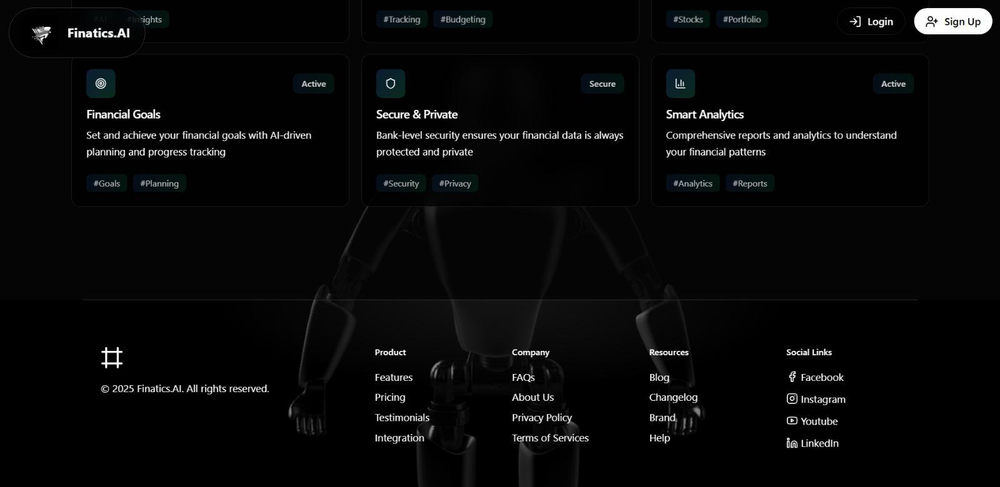
*Footer with navigation links and platform information*

---

### Authentication Flow

| Sign Up | Login |
|---------|-------|
| 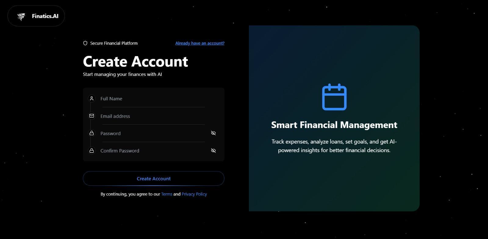 | 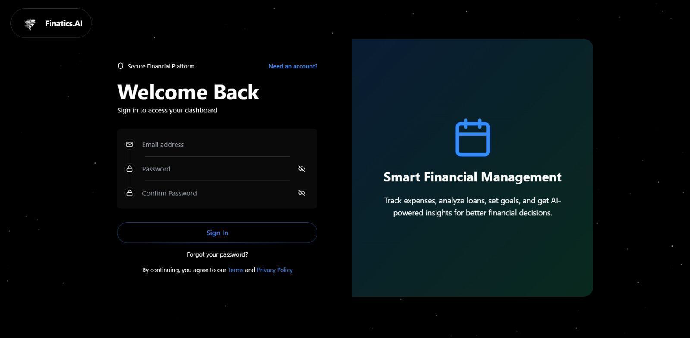 |

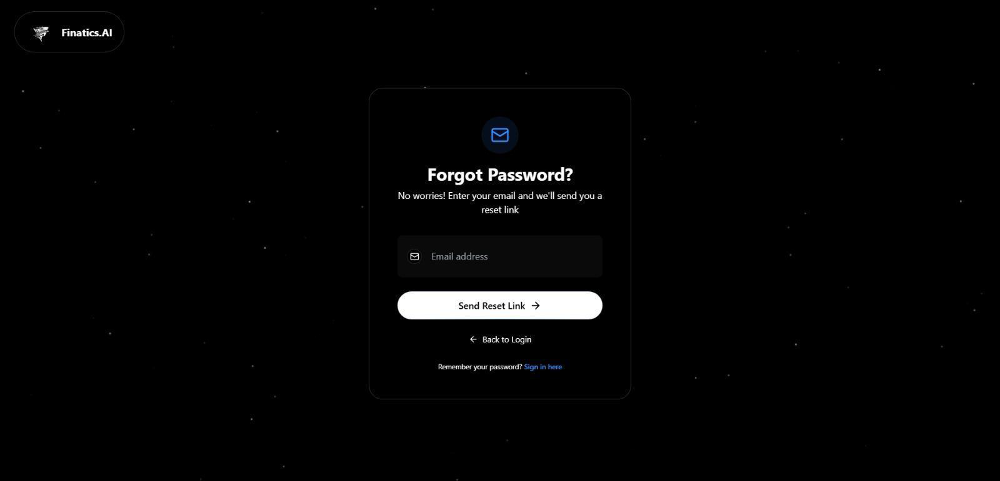
*Password reset with Supabase email OTP verification*

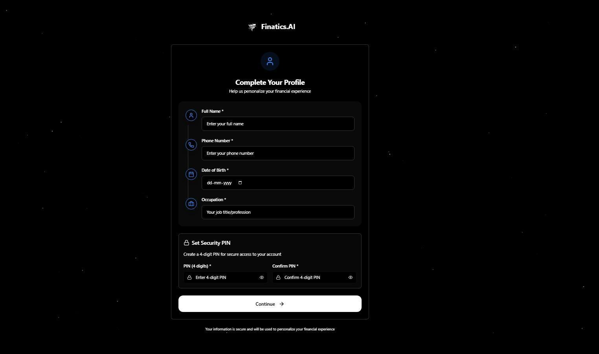
*Profile completion after first login*

| Enter PIN | Add Bank Account | Bank Account Details |
|-----------|-----------------|---------------------|
| 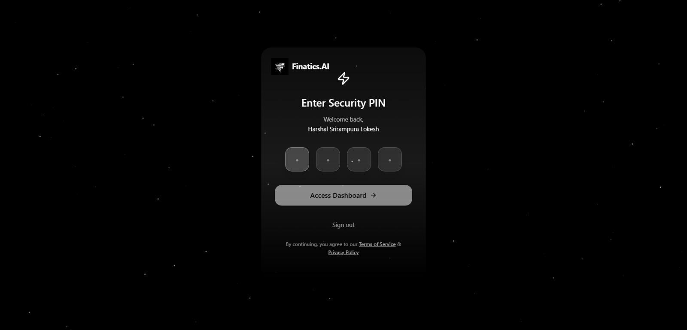 | 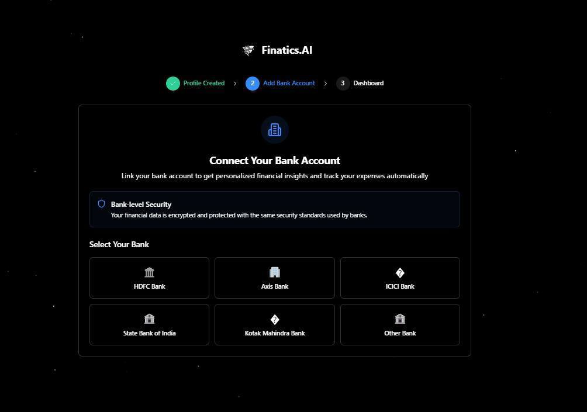 | 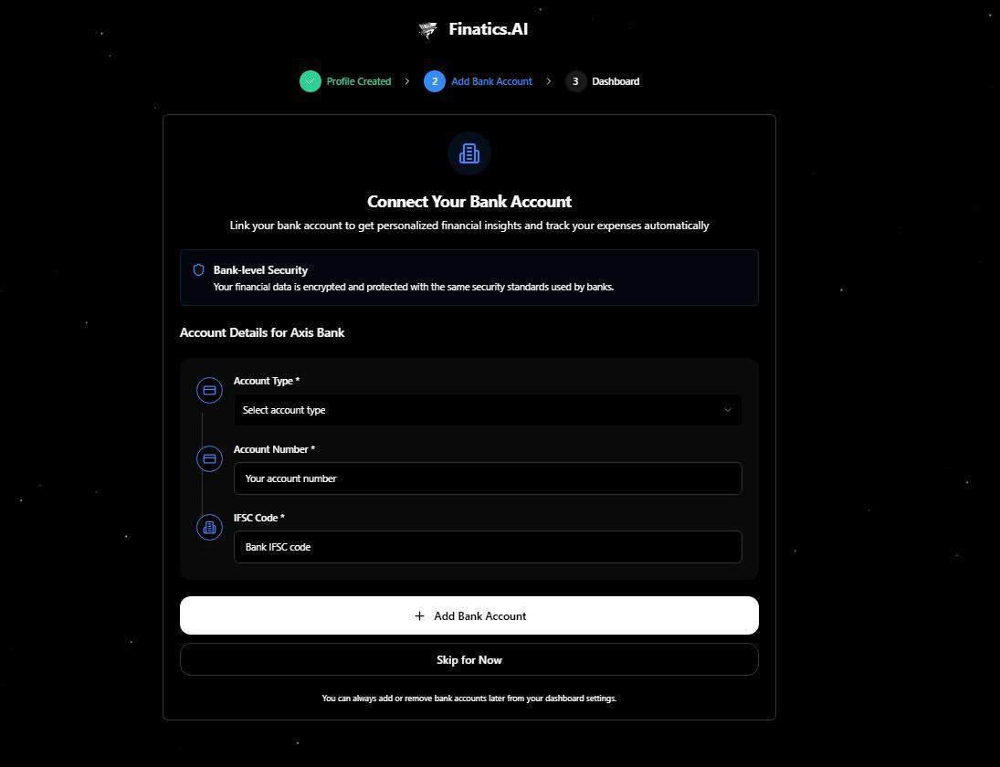 |

---

### Dashboard

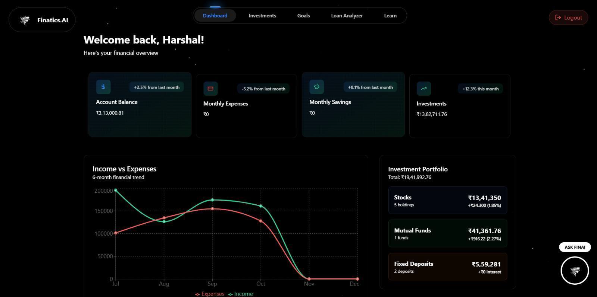
*Unified dashboard showing balance, transactions, investments, and spending analytics*

---

### Stocks & Portfolio

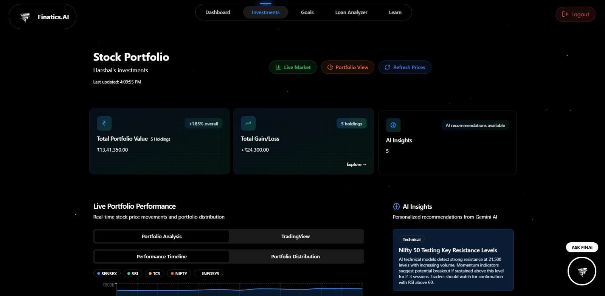
*Live NSE stock portfolio with real-time P&L tracking*


*Market overview and curated top financial news*


*AI-powered portfolio analysis with weekly market insights*

---

### AI Features


*Context-aware financial chatbot powered by Google Gemini 1.5 with personalized advice*


*AI-driven loan eligibility analysis using credit score and 3-month transaction history*


*Detailed loan recommendations with improvement tips*

---

### Goal Planner


*AI-generated savings strategy with SIP recommendations based on financial profile*

---

### Learn


*Financial education hub with categorized videos and guides*

---

## 🚀 Getting Started

### Prerequisites

- Node.js ≥ 18.x
- npm ≥ 9.x
- Supabase account (two projects — App DB and Banking DB)
- Google Gemini API Key
- Git

---

### 1. Clone the Repository

```bash
git clone https://github.com/yourusername/finai.git
cd finai
```

---

### 2. Backend Setup

```bash
cd backend
npm install
cp .env.example .env
```

Fill in your `.env` (see [Environment Variables](#-environment-variables) section), then:

```bash
npm run dev
# Server starts on http://localhost:3000
```

---

### 3. Frontend Setup

```bash
cd ../frontend
npm install
cp .env.example .env
```

Fill in your frontend `.env`, then:

```bash
npm run dev
# App starts on http://localhost:5173
```

---

## 🔑 Environment Variables

### Backend — `backend/.env`

```env
# Application Database (Supabase)
APP_DB_URL=your_app_supabase_url
APP_DB_ANON_KEY=your_app_supabase_anon_key

# Banking Database (Supabase)
BANKING_DB_URL=your_banking_supabase_url
BANKING_DB_ANON_KEY=your_banking_supabase_anon_key

# Google Gemini AI
GEMINI_API_KEY=your_gemini_api_key

# Server
PORT=3000
NODE_ENV=development
FRONTEND_URL=http://localhost:5173
```

### Frontend — `frontend/.env`

```env
# Supabase Authentication
VITE_SUPABASE_URL=your_supabase_url
VITE_SUPABASE_ANON_KEY=your_supabase_anon_key

# Backend API
VITE_API_BASE_URL=http://localhost:3000
```

---

## 📡 API Endpoints

### Authentication & Users
| Method | Endpoint | Description |
|--------|----------|-------------|
| `POST` | `/api/users/register` | Register new user |
| `POST` | `/api/users/login` | User login |
| `GET` | `/api/users/profile` | Get user profile |
| `PUT` | `/api/users/profile` | Update profile |
| `POST` | `/api/users/pin` | Create/update PIN |
| `POST` | `/api/users/verify-pin` | Verify PIN |

### Dashboard
| Method | Endpoint | Description |
|--------|----------|-------------|
| `GET` | `/api/dashboard` | Full dashboard summary |
| `GET` | `/api/dashboard/accounts` | User bank accounts |
| `POST` | `/api/dashboard` | Add bank account |

### Investments & Holdings
| Method | Endpoint | Description |
|--------|----------|-------------|
| `GET` | `/api/investments` | All investments summary |
| `GET` | `/api/holdings/account/:id` | Holdings by account |
| `GET` | `/api/holdings/account/:id?realtime=true` | Live-priced holdings |

### Stocks & Market
| Method | Endpoint | Description |
|--------|----------|-------------|
| `GET` | `/api/news` | Financial news feed |
| `GET` | `/api/news/market-trends` | Market trend analysis |

### Transactions
| Method | Endpoint | Description |
|--------|----------|-------------|
| `GET` | `/api/transactions` | User transactions |
| `GET` | `/api/transactions/categories` | Spending categories |

### AI Features
| Method | Endpoint | Description |
|--------|----------|-------------|
| `POST` | `/api/chatbot/query` | AI chatbot message |
| `GET` | `/api/ai-insights` | AI market insights |
| `POST` | `/api/loan-analyzer` | Analyze loan request |
| `GET` | `/api/loan-analyzer/metrics` | Loan metrics only |

### Goals
| Method | Endpoint | Description |
|--------|----------|-------------|
| `GET` | `/api/goals` | Get user goals |
| `POST` | `/api/goals` | Create & analyze goal |
| `PUT` | `/api/goals/:id` | Update goal |
| `DELETE` | `/api/goals/:id` | Delete goal |

### Bank Accounts
| Method | Endpoint | Description |
|--------|----------|-------------|
| `GET` | `/api/bank-accounts` | List linked accounts |
| `POST` | `/api/bank-accounts` | Link new account |
| `DELETE` | `/api/bank-accounts/:id` | Unlink account |

---

## 🗄 Database Schema

### Application Database (Supabase)

| Table | Purpose |
|-------|---------|
| `auth_users` | Supabase auth — email, verification status |
| `user_profiles` | Extended profile — income, occupation, DoB |
| `users` | Core user data — name, phone |
| `user_pins` | Bcrypt-hashed PIN storage |
| `linkedbankaccounts` | Bank account linking records |
| `financialgoals` | Goal tracking — target, saved, deadline |
| `subscriptions` | Recurring payment tracking |
| `airequests` | AI service request logging |

### Banking Database (Supabase)

| Table | Purpose |
|-------|---------|
| `bank_accounts` | Account numbers, balances, types |
| `customers` | Customer data with credit scores |
| `transactions` | Full transaction history |
| `demat_accounts` | Stock demat account records |
| `stock_holdings` | Individual stock positions |
| `mutual_funds` | MF portfolio holdings |
| `fixed_deposits` | FD records with maturity dates |

---

## 📁 Project Structure

```
finai/
├── backend/
│   ├── config/
│   │   ├── supabase.js          # Dual DB configuration
│   │   └── stripe.js            # Payment config
│   ├── controllers/             # Route handlers
│   │   ├── chatbotController.js
│   │   ├── dashboardController.js
│   │   ├── goalAnalyzerController.js
│   │   ├── holdingsController.js
│   │   ├── investmentController.js
│   │   ├── loanAnalyzerController.js
│   │   └── ...
│   ├── services/
│   │   ├── ai/
│   │   │   ├── geminiService.js     # Gemini AI client
│   │   │   └── chatbotService.js    # Chat logic
│   │   ├── dashboardService.js
│   │   ├── investmentService.js
│   │   ├── loanAnalyzerService.js
│   │   ├── goalAnalyzerService.js
│   │   ├── marketAnalysisService.js # RSI, MACD, EMA
│   │   ├── marketDataCacheService.js
│   │   ├── nseStockService.js       # Yahoo Finance
│   │   └── newsService.js
│   ├── middlewares/
│   │   ├── authMiddleware.js
│   │   └── errorMiddleware.js
│   ├── routes/                  # Express routers
│   ├── models/
│   └── server.js
│
├── frontend/
│   └── src/
│       ├── pages/
│       │   ├── Dashboard.jsx
│       │   ├── Stocks.jsx
│       │   ├── Goals.jsx
│       │   ├── LoanAnalyzer.jsx
│       │   ├── FinanceChatbot.jsx
│       │   ├── Transactions.jsx
│       │   ├── Learn.jsx
│       │   └── ...
│       ├── components/
│       ├── contexts/
│       │   └── AuthContext.jsx
│       ├── hooks/
│       └── lib/
│
└── images/                      # Application screenshots
```

---

## 🛣 Roadmap

- [ ] Push notifications for price alerts and goal milestones
- [ ] Multi-currency support beyond INR
- [ ] Export reports as PDF / Excel
- [ ] WhatsApp bot integration for quick balance checks
- [ ] AI-powered tax planning module
- [ ] Mobile app (React Native)

---

## 📄 License

This project is licensed under the **ISC License**.

---

## 📬 Contact

**Harshal S L**

[](mailto:harshalsl2005@gmail.com)

> 📧 **harshalsl2005@gmail.com**

Feel free to reach out for any queries, collaboration opportunities, or feedback regarding this project.

---

<div align="center">

Made with  by **Team Finatics.AI**

⭐ Star this repository if you found it helpful!

</div>
